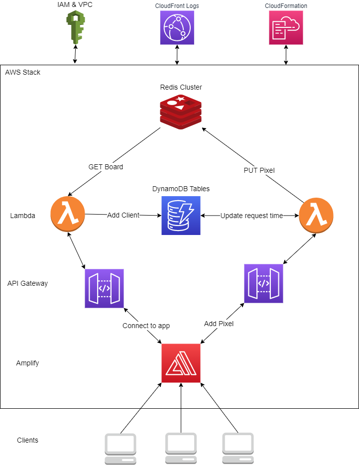

# r-place

We recreated Reddit's famous April Fools event called r/place where individuals around the world can contribute one pixel every 5 minutes onto a shared canvas. 

## Getting Started:

1. Create your own repo to be used with AWS Amplify 
2. Add index.html and jquery file to repo
3. Edit yaml file to include newly created repo with access token
4. Launch application using CloudFormation

## Design

We designed this system using the principles that the [original creators of r/place used](https://www.redditinc.com/blog/how-we-built-rplace/).
Using Amazon Web Services, our system is a fully serverless experience with a multiude of Amazon services working together which includes:
- Amplify
- Lambda
- Elasticache 
- DynamoDB
- API Gateway
- CloudFormation
- IAM
- CloudWatch
- VPC
- S3

## Repo breakdown:

Lambda Functions are contained within directories if they are Javascript based or standalone if they are python based. Directories contain an index.js file with their package.json. 

The CloudFormation file is called CFM.YAML

The report can be found in a3.pdf, along with an a3.png for our diagram. 
